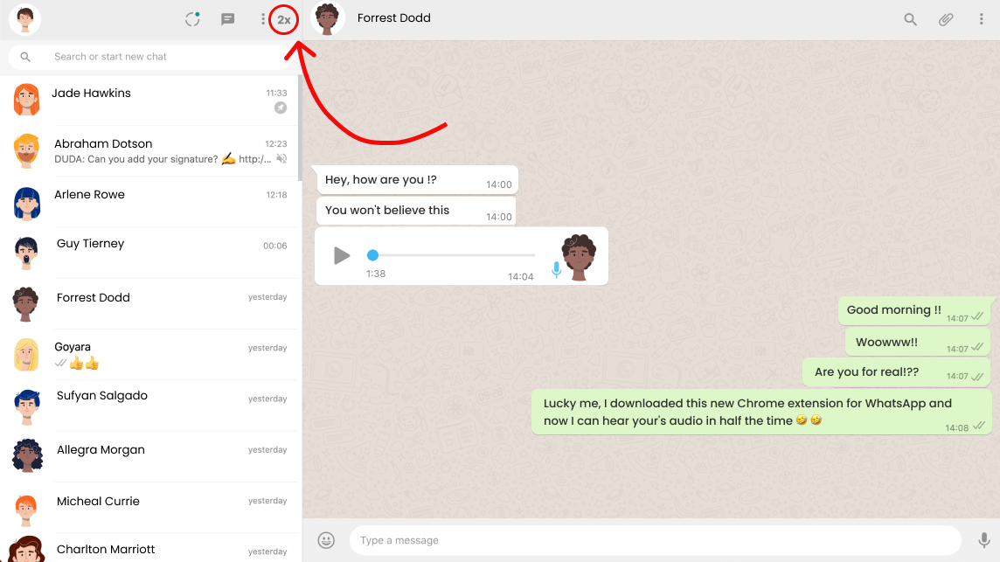

<h1 align="center">
    
</h1>

<h4 align="center"> 
	:heavy_check_mark: Weekend project Done!

	

 

## 💻 Projeto

The WhatsApp extension is a side project develop in a weekened. It uses a simple Javascript function to speed up two times WhatsApp audio.
## :rocket: Tecnologias

Esse projeto foi desenvolvido usando as seguintes tecnologias:

- [JavaScript](https://developer.mozilla.org/en-US/docs/Web/JavaScript)

## 🤔 If you want to contribute:

- Create a fork of the project
- Clone this fork to create a local repository;
- Make changes to your copy of the original project commit : `git commit -m 'feat: My new feature'`;
- Then push them: `git push origin my-feature`;

- When you are ready to share the results of your work, rebase your fork on the current HEAD of the master branch in the original project;
- Create a pull request to suggest your changes to the original project.

